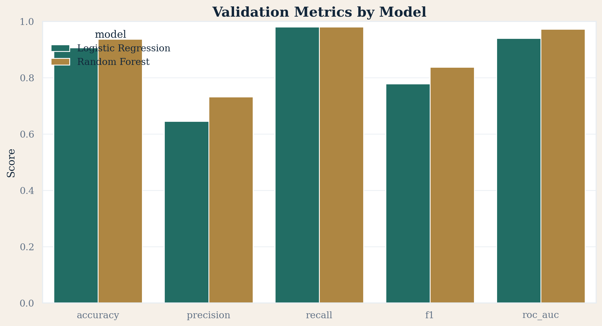
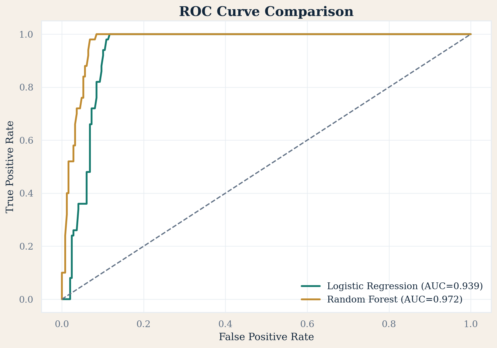

# Xente Loan Default Prediction

Prepared by **OMODING ISAAC (B31331)**  
Course: **DSC8305 - Business, Management and Financial Data Analytics**  
Institution: **Uganda Christian University**

## Project Overview

This repository contains a complete loan default prediction project based on the Xente credit-risk case study. It is designed to satisfy two goals at the same time:

1. support an academic exam submission with clear business framing, transparent methodology, and polished outputs
2. run reliably as a saved-artifact Streamlit application on a local machine or Streamlit Community Cloud

The repository includes the analysis notebooks, pipeline code, saved model artifacts, generated figures, report materials, and a Streamlit app for exploration and borrower scoring.

## Business Problem

Xente is a digital payments and credit platform. Loan default reduces profitability, weakens portfolio sustainability, and complicates lending decisions. The project addresses this business problem by using transaction and loan-linked behaviour data to estimate whether a borrower is likely to default.

## Objective

Build a **binary classification** workflow that predicts the target variable `IsDefaulted` while remaining:

- leakage-aware
- reproducible
- interpretable enough for academic review
- deployable without retraining at app startup

## Dataset Files Used

The repository includes the required CSV files under [`data/`](data):

- `TRAIN.csv` - core development dataset for EDA, feature engineering, training, and validation
- `TEST.csv` - unseen scoring dataset used after the final model is selected
- `VariableDefinitions.csv` - feature dictionary used for explanation and reporting
- `unlinked_masked_final.csv` - auxiliary transaction-history dataset used to enrich customer behaviour features

Important note:
- The repository intentionally tracks dataset copies in `data/`.
- Additional root-level CSV copies may exist in a local workspace, but they are ignored and are **not** part of the repository workflow.

## Repository Structure

```text
xente-credit-risk-analytics/
├── .streamlit/
│   └── config.toml
├── app/
│   ├── app.py
│   └── utils.py
├── data/
│   ├── TRAIN.csv
│   ├── TEST.csv
│   ├── VariableDefinitions.csv
│   └── unlinked_masked_final.csv
├── models/
│   ├── final_model.joblib
│   └── model_metadata.json
├── notebooks/
│   ├── 01_data_understanding.ipynb
│   ├── 02_cleaning_and_eda.ipynb
│   ├── 03_feature_engineering.ipynb
│   └── 04_modeling_and_evaluation.ipynb
├── outputs/
│   ├── cleaned/
│   ├── figures/
│   ├── metrics/
│   └── predictions/
├── reports/
│   ├── final_report.md
│   ├── presentation_outline.md
│   └── Xente_Loan_Default_Presentation_B31331.pptx
├── src/
│   ├── analysis.py
│   ├── build_notebooks.py
│   ├── config.py
│   ├── data_prep.py
│   ├── modeling.py
│   ├── notebooks.py
│   ├── presentation.py
│   ├── reporting.py
│   ├── run_pipeline.py
│   └── utils.py
├── requirements.txt
├── streamlit_app.py
└── README.md
```

## Methodology Summary

The project follows this order:

1. understand the business problem
2. inspect the datasets and modelling unit
3. isolate labelled observations from `TRAIN.csv`
4. perform EDA and missing-value analysis
5. review outliers and apply defensible transformations
6. engineer transaction, timing, and prior-customer-behaviour features
7. screen out leakage-prone and identifier-only variables
8. compare two classification models using a time-aware validation split
9. save the final model, metadata, outputs, and predictions
10. present the solution through notebooks, reports, and Streamlit

## Leakage Awareness

This project explicitly excludes post-outcome variables that would make the model unrealistically strong in deployment. Examples include:

- `PaidOnDate`
- `IsFinalPayBack`
- `DueDate`
- `PayBackId`
- `IsThirdPartyConfirmed`

Raw identifiers such as `CustomerId`, `TransactionId`, and `LoanId` are also excluded from direct modelling. Instead, the pipeline derives behavioural summaries such as prior transaction counts, prior amount totals, recency, and customer tenure.

## Modeling Approach

Two models are compared on the same leak-safe feature set:

- **Logistic Regression** for a transparent baseline
- **Random Forest** for nonlinear relationships and interactions

The current saved best model is recorded in [`models/model_metadata.json`](models/model_metadata.json). The app loads the saved pipeline and metadata directly rather than retraining.

## Artifacts Produced

The repository intentionally tracks the main generated artifacts so the project can be reviewed and deployed without rerunning everything first:

- cleaned modelling and scoring datasets in `outputs/cleaned/`
- polished figures in `outputs/figures/`
- metrics tables in `outputs/metrics/`
- final unseen predictions in `outputs/predictions/`
- saved model and metadata in `models/`
- final report and presentation materials in `reports/`

## Reproducibility

### Required vs optional

Required for full rebuild:
- the four CSV files in `data/`
- Python environment with the packages in `requirements.txt`

Optional:
- rerunning the full pipeline if you only want to use the saved app artifacts
- rebuilding notebooks and presentation assets if the existing outputs are sufficient

### Exact execution order

1. install dependencies
2. optionally rerun the analysis pipeline
3. optionally rebuild notebooks
4. launch the Streamlit app

### Saved-artifact behavior

The Streamlit app is designed to load:

- the saved model
- saved metadata
- saved metrics tables
- saved figures
- saved predictions

It does **not** retrain at startup.

## How to Run Locally

Create and activate a Python environment, then run:

```bash
pip install -r requirements.txt
```

Optional full rebuild:

```bash
python -m src.run_pipeline
python -m src.build_notebooks
python -m src.presentation
```

Launch the app:

```bash
streamlit run streamlit_app.py
```

Notes:
- On some systems, you may need `python3` instead of `python`.
- If you only want to view the deployed result locally, you can skip pipeline regeneration and run the app directly because the saved artifacts are already committed.

## How to Deploy on Streamlit Community Cloud

Use the following settings:

- **Repository:** this GitHub repository
- **Branch:** `main`
- **Main file path:** `streamlit_app.py`

Deployment steps:

1. push the latest repository state to GitHub
2. open Streamlit Community Cloud
3. choose this repository and branch
4. set the main file path to `streamlit_app.py`
5. deploy

Why this works:
- `streamlit_app.py` is the cloud-safe entry point
- `.streamlit/config.toml` contains the repository-level Streamlit configuration
- the app uses committed artifacts in `models/`, `outputs/`, and `reports/`

## Expected Input Files / Where to Place Data

If the repository is cloned without data for any reason, place these files in the `data/` directory:

- `TRAIN.csv`
- `TEST.csv`
- `VariableDefinitions.csv`
- `unlinked_masked_final.csv`

The pipeline expects those exact names.

## Outputs Generated

Running the pipeline creates or refreshes:

- `outputs/cleaned/` - cleaned modelling and scoring datasets
- `outputs/figures/` - premium charts used in notebooks, reports, and the app
- `outputs/metrics/` - tabular summaries, relationship tests, and model comparison results
- `outputs/predictions/` - generated predictions for `TEST.csv`
- `models/` - the saved final pipeline and metadata
- `reports/` - report text and PowerPoint assets

## README Visuals

Example generated visuals:





If you want app screenshots for submission, add them to a `docs/` or `assets/` folder and reference them here.

## Key Findings

- The modelling workflow benefits strongly from customer-history features built from prior transactions.
- A leak-safe approach matters because several loan lifecycle fields are only known after repayment events.
- The final saved model provides strong discrimination while remaining deployable through a stable artifact-based pipeline.

## Limitations

- The project depends on the structure and coverage of the provided CSV files.
- The Streamlit prediction form uses representative defaults for some advanced features rather than collecting every possible model input from a real production system.
- Model performance should be monitored over time because borrower behaviour and portfolio mix can shift.

## Future Improvements

- add richer borrower profile inputs from upstream operational systems
- introduce formal model monitoring and drift tracking
- add calibration plots and cost-sensitive threshold analysis
- include dedicated app screenshots and demo narration for submission packaging

## How This Maps to Exam Requirements

This repository directly supports the Section B exam tasks by providing:

- dataset inspection and distribution analysis
- missing-value and outlier handling
- relationship analysis with plots and statistical tests
- feature engineering and selection
- comparison of two models
- business interpretation and recommendations
- presentation-ready materials and deployment

## Author

**OMODING ISAAC**  
Student Number: **B31331**

## Academic-Use Note

This repository is intended for academic demonstration, assessment, and portfolio presentation for the Xente loan default prediction project. Review your institution’s submission and originality requirements before reusing any part of the work elsewhere.

